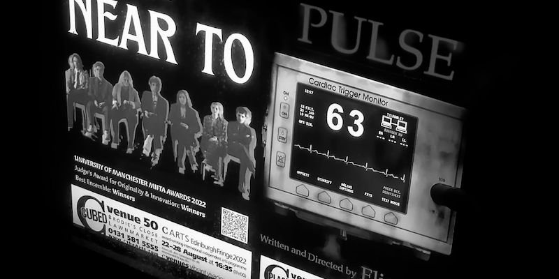

PI DISPLAY SLIDESHOW
====================

Raspberry PI slideshow for viewing a set of posters on a large screen
display. The posters should be available as a publicly readable Dropbox
folder, provided as a download URL to the script.

They can be viewed as a slideshow, with a configurable delay between each
poster and the Dropbox folder will be refreshed after a configurable cycle
time also. The posters can be rotated 90 degrees for display on a portrait
mode monitor, or displayed on a landscape orientation screen either singly
or in pairs.



Settings for these options are made in a `.ini` configuration file by
setting variables, which are documented below.

### Version

The latest version is 0.1.6 and the latest release is
[0.1.6](https://github.com/grkvlt/pi-display-slideshow/releases/tag/version-0.1.6).

This software is provided as Open Source using the Apache 2.0 license and
is currently maintained by Andrew Kennedy.  All contributions are welcome,
including bug reports and pull requests, at the project's GitHub page.

## Install

Download the install artifacts and extract the contents, then run the
`install.sh` script as root. The target directory to install to shouyld be
specified as the only argument to the script, as follows:

```shell
$ wget https://github.com/grkvlt/pi-display-slideshow/archive/refs/tags/version-0.1.6.tar.gz
...
$ tar zxvf version-0.1.6.tar.gz
pi-display-slideshow-version-0.1.6/
...
$ cd pi-display-slideshow-version-0.1.6
$ sudo ./install.sh /opt/slideshow
...
```

Installation can take several minutes, or longer on a slow connection or
older Raspberry Pi.

### Configuration

Configure the Raspberry PI as follows:

* no screenblank
* ssh/vnc enabled

For best results, the display screen should be rotated 90 degrees into
portrait mode, so that the aspect ratio more closely matches the posters to
be displayed.

## Usage

Run the `slideshow.sh` script, which should be available on the users PATH
after installation. You may need to re-login for this to take effect. If no
arguments are provided, the [`slideshow.ini`](slideshow.ini) installed in
the same directory as the script will be used, otherwise the first argument
should point to a file with the configuration variables for the slideshow.

```
$ slideshow.sh landscape.ini
```

### Posters

The slideshow linked to by `DROPBOX_URL` should point to the public
download link for an entire folder.  This is exported as a `.zip` archive
on [Dropbox](https://dropbox.com/) and [Google
Drive](https://drive.google.com/), but any archive file available over HTTP
is suitable. The poster files it contains can be `.pdf` format or bitmap
files such as `.jpeg` or `.png` of any resolution. These images will be
converted as part of the slideshow processing, but it should be noted that
smaller files will download more quickly. The slideshow link is checked
regularly every `SLIDESHOW_LENGTH` minutes, and any new or modified posters
will be displayed once the updated archive is downloaded and processed.

### Settings

The following variables can be set in the configuration file:

- **`DROPBOX_URL`** - _Dropbox download link for posters_
- **`SLIDESHOW_DIR`** - _Folder to save files into (defaults to `./slideshow`)_
- **`SLIDESHOW_LENGTH`** - _Slideshow length in minutes (defaults to 30)_
- **`SLIDESHOW_DELAY`** - _Delay between slides in seconds (defaults to 10)_
- **`SLIDESHOW_ROTATE`** - _Rotate posters for portrait mode? (default true)_
- **`SLIDESHOW_JOIN`** - _Join two posters with same prefix in landscape mode? (default false)_
- **`SCREEN_RES`** - _Hardcoded screen resolution as `XXXXxYYY`_

### Config File

The following configuration should be saved as `landscape.ini` and can be
used to display posters in landscape mode. Pairs of files will be
concatenated horizontally and shown together.

```bash
# LANDSCAPE
DROPBOX_URL="https://www.dropbox.com/sh/wra6omoa0f12fzj/AADvDwf3ph4ajB4QFrBMv3Qca"
SLIDESHOW_DIR="/posters"
SLIDESHOW_LENGTH="60"
SLIDESHOW_DELAY="15"
SLIDESHOW_ROTATE="false"
SLIDESHOW_JOIN="true"
```

---
_Copyright 2022 by [Andrew Donald Kennedy](mailto:andrew.international@gmail.com)_ and
_Licensed under the [Apache Software License, Version 2.0](http://www.apache.org/licenses/LICENSE-2.0)_